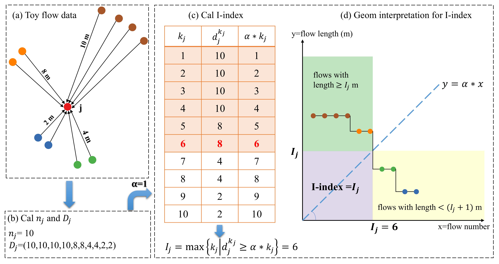

# I-index
This repository contains a Python implementation of the **I-index**, a novel flow-based locational measure to quantify an urban location's irreplaceability.
> Wang, X., Chen, J., Pei, T.*, Song, C., Liu, Y., Shu, H., … Chen, X. (2021). I-index for quantifying an urban location’s irreplaceability. Computers, Environment and Urban Systems, 90, Article 101711. https://doi.org/10.1016/j.compenvurbsys.2021.101711

## Brief Introduction of the I-index
Following the philosophy of the well-known H-index in bibliometric analysis, which quantifies a scientist's academic achievements by both number and citations of papers, the I-index elegantly combines the flow volume and flow length into a single value. Formally, I-index of a location is the maximum value of i such that at least i flows with a length of at least α * i meters have reached this location, where α is the conversion factor that can be determined adaptively from the flow dataset. Figure below illustrates an example of the calculation of the I-index and its geometric interpretation assuming α = 1.


## Usage
[Flow_I_index.py](Flow_I_index.py) contains the calcuation of the I-index given an OD flow dataset ([bj_od_sample.csv](data/bj_od_sample.csv)) and a grid file ([grid.csv](data/grid.csv))
### Inputfile:
`bj_od_sample.csv`
- **odid** (int)：OD flow ID  
- **olon** (float)：longitude of O point (WGS84)  
- **olat** (float)：latitude of O point (WGS84)    
- **dlon** (float)：longitude of D point (WGS84) 
- **dlat** (float)：latitude of D point (WGS84)
  
`grid.csv`
- **polyid** (int)：polygon ID  
- **geometry** (str)：wkt of the polygon (WGS84)
### Outputfile:
`grid_iidx.csv`
- **polyid** (int)：polygon ID  
- **alpha** (float)：conversion factor  
- **I_index** (float)：I-index    
- **flowtotalcnt** (float)：total flow volume
- **flowtotallength** (float)：total flow length (unit:km)

## Citation

If you use this code in your research, please cite our paper:

```bibtex
@article{WANG2021101711,
title = {I-index for quantifying an urban location's irreplaceability},
journal = {Computers, Environment and Urban Systems},
volume = {90},
pages = {101711},
year = {2021},
issn = {0198-9715},
doi = {https://doi.org/10.1016/j.compenvurbsys.2021.101711},
url = {https://www.sciencedirect.com/science/article/pii/S0198971521001186},
author = {Xi Wang and Jie Chen and Tao Pei and Ci Song and Yaxi Liu and Hua Shu and Sihui Guo and Xiao Chen},
keywords = {Locational measure, Irreplaceability, Origin-destination flow, Flow mapping, H-index}
}
```
