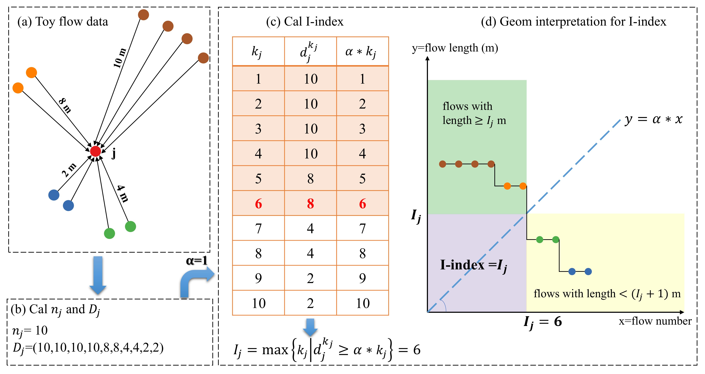

# Flow_I_index
This repository contains a Python implementation of the **I-index**, a novel flow-based locational measure to quantify an urban location's irreplaceability.
> Wang, X., Chen, J., Pei, T.*, Song, C., Liu, Y., Shu, H., … Chen, X. (2021). I-index for quantifying an urban location’s irreplaceability. Computers, Environment and Urban Systems, 90, Article 101711. https://doi.org/10.1016/j.compenvurbsys.2021.101711

## Brief Introduction
Following the philosophy of the well-known H-index in bibliometric analysis, which quantifies a scientist's academic achievements by both number and citations of papers, the I-index elegantly combines the flow volume and flow length into a single value. Formally, I-index of a location is the maximum value of i such that at least i flows with a length of at least α * i meters have reached this location, where α is the conversion factor that can be determined adaptively from the flow dataset.

